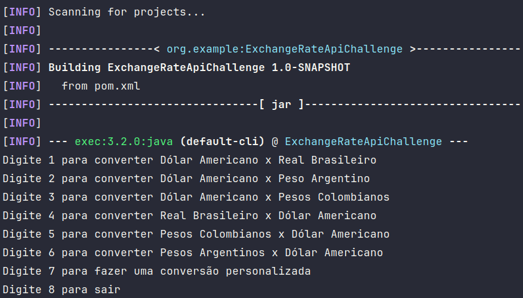

# Conversor de Moedas - Challenge Alura/Oracle One
Este projeto, desenvolvido como parte do Challenge Alura/Oracle One, implementa um conversor de moedas completo utilizando a API "ExchangeRate-API". Através de uma interface textual amigável, o usuário pode realizar conversões entre diversas moedas, com taxas de câmbio atualizadas em tempo real.

## Funcionalidades
- Menu com 6 opções de conversão de moedas, além de uma opção para conversão personalizada.
- Obtenção dinâmica das taxas de câmbio através da API "ExchangeRate-API".
- Conversão precisa e atualizada para uma experiência mais confiável.



## Clonando o Repositório
Para clonar o repositório deste projeto, siga as instruções abaixo:
- Abra o terminal (Linux/Mac) ou o Git Bash (Windows).
- Navegue até o diretório onde deseja clonar o repositório.
- Execute o seguinte comando:

```bash
git clone git@github.com:igopereira1/exchangerate-api-challenge.git
```

## Compilando e Executando o Projeto
- Navegue até o diretório do projeto.
- Certifique-se de que o arquivo `.env` contendo a chave da API "ExchangeRate-API" está presente na raiz do projeto.
- Execute o seguinte comando para compilar o projeto:

```bash
cd exchangerate-api-challenge
mvn compile
mvn exec:java -Dexec.mainClass="br.com.igopereira1.exchangerateapi.main.Main"
```

## Tecnologias utilizadas

- JAVA
- GSON
- dotenv-java

## Variáveis de Ambiente
É crucial criar um arquivo `.env` na raiz do projeto contendo uma chave da [ExchangeRate-API](https://www.exchangerate-api.com/).

Exemplo:

```bash
API_KEY=YOUR_API_KEY
```


